#### prctl函数

prctl可控制进程、进程中的线程、父子进程


例：

**代表在父进程退出时，杀死子进程。可解决孤儿进程**

**PR_SET_PDEATHSIG**是其中一个选项，它表示设置父进程退出时的信号


#### 优先级

**.、[]、（）**的优先级都高于*****


***和++、--的优先级一致，但在结合时，按照从右往左的顺序进行结合**

例：*p++ 是指针先+1,然后再取指针的值

(*p)++ 是先取p的值，然后p的值+1

*++p 是给p指针+1， 然后访问新指针指向的值

#### 移动语义

移动语义：深拷贝对象需要new，比较消耗资源，可以使用移动构造函数，来创建对象

```c++
#include <iostream>
//移动语义和完美转发
using namespace std;
class base{
public:
    int* m_data= nullptr;
    //本来的构造函数
    base(int* data){
        this->m_data=data;
    }
    //拷贝构造函数
    base(base& b){
        cout<<"这是拷贝构造函数"<<endl;
        this->m_data=new int(*(b.m_data));
        cout<<*(this->m_data)<<endl;
    }
    //移动构造函数
     base(base&& rbase){
        cout<<"移动构造函数"<<endl;
        this->m_data=rbase.m_data;
        rbase.m_data= nullptr;//把右值引用设为空

    }
    //移动赋值函数
    base operator=(base&& rbase)noexcept{
        cout << "移动赋值函数" << endl;
        if(this!=&rbase) {
            if(this->m_data!= nullptr) {
                this->m_data = rbase.m_data;
                rbase.m_data = nullptr;
                return *this;
            }
        }

    }
private:

};

static base getbase(){
    int data7=1000;
    int* dataptr=&data7;
    base b(dataptr);

};

int main() {

    int data=100;
    int data2=200;
    int data3=300;
    int* dataptr=&data;
    int* dataptr2=&data2;
    int* dataptr3=&data3;
    base base1(dataptr);
    base base2(base1);
    base base6(dataptr3);


    //通过move函数，将左值引用转换为右值引用
    base base3(dataptr2);
    base base4(std::move(base3));
    cout<<*base4.m_data<<endl;

    base base5=getbase();
    cout<<*base5.m_data<<endl;
    return 0;
}

```

**左值是存在内存地址，右值是存在寄存器上**

下面是移动语义的模板代码：

```c++
class A {
public:
    T* t;
    A(A& a) {//拷贝构造函数
        t = new T(*a.t);//新的空间
    }
    A(A&& a) {//移动构造函数
        t = a.t;//直接使用a.t中的空间
        a.t = NULL;//将a.t赋值null，避免a析构时把a.t指向的空间释放掉
    }
};
```

#### 引用折叠

折叠是多个的意思，引用折叠即为双重引用

```cpp
- 左值-左值 T& & 
- 左值-右值 T& &&
- 右值-左值 T&& &
- 右值-右值 T&& &&
```

原则：只要有一个左值引用，则最后为左值引用。只有两个都为右值引用才为右值引用

 "数组、new和malloc都是从堆上分配内存"

#### 水平模式、边缘模式

**水平模式：只要该数据一直有，就会一直触发---效率低**


**边缘模式：数据从无到有，会触发**


#### 菱形继承、虚基类


参考：

https://blog.csdn.net/c_base_jin/article/details/86036185


形如下，菱形继承会造成内存浪费，class C会同时保留两份公共基类N，为避免这个问题，引入虚基类，保证只需要保留一份公共基类：


#### GCC编译流程


#### g++ 常用命令选项


#### 基本数据类型


#### muduo学习

参考：

**muduo的设计如下：**


https://github.com/hujiese/MuduoStudy/blob/master/12.Poller/EPollPoller/README.md

**muduo的本质是reactor不断去监听fd，根据fd发生的不同事件来调用相对应的回调函数**

**channel类似于fd的保姆**

**一个channel对应一个fd**


**poller监听文件描述符的事件是否被触发，并返回发生事件的文件描述符**


```c++
EventLoop::EventLoop()
  : looping_(false),
    threadId_(CurrentThread::tid())
{
  LOG_TRACE << "EventLoop created " << this << " in thread " << threadId_;
  // 如果当前线程已经创建了EventLoop对象，终止(LOG_FATAL)
  if (t_loopInThisThread)
  {
    LOG_FATAL << "Another EventLoop " << t_loopInThisThread
              << " exists in this thread " << threadId_;
  }
  else
  {
    t_loopInThisThread = this;
  }
}

void assertInLoopThread()
{
  if (!isInLoopThread())
  {
    abortNotInLoopThread();
  }
}

bool isInLoopThread() const { return threadId_ == CurrentThread::tid(); }

void EventLoop::abortNotInLoopThread()
{
  LOG_FATAL << "EventLoop::abortNotInLoopThread - EventLoop " << this
            << " was created in threadId_ = " << threadId_
            << ", current thread id = " <<  CurrentThread::tid();
} 
```

Channel，你可以理解为是一个“通道”，该“通道”中绑定了一个文件描述符及其所关注事件、注册的读写事件等信息，Channel是文件的一个代表。

一个EventLoop一定关联一个channel


poller本质是去监听event，然后根据event去操作channel

**loop一直轮询调用poll，去遍历文件描述符，PollFdList代表文件描述符和事件的对应，ChannelMap是文件描述符和channel的一一对应关系，poll去调用fillactivechannel函数，找到我们需要的事件，在PollFdList找到对应的fd，然后在ChannelMap找到对应的channel，然后返回事件对应的channel，然后loop直接调用handevent去处理事件，该函数将事件与回调函数绑定，直接去执行回调函数**


muduo通过timeid来实现定时器


**任何一个线程，只要创建并运行了EventLoop，都称之为IO线程，所以IO线程不一定是主线程**

EventLoopThread类创建了一个线程，并在io线程创建Eventloop对象，并调用loop函数

```c++
EventLoopThread::EventLoopThread(const ThreadInitCallback& cb)
  : loop_(NULL),
    exiting_(false),
    thread_(boost::bind(&EventLoopThread::threadFunc, this)),
    mutex_(),
    cond_(mutex_),
    callback_(cb)
{
}
```


```c++
EventLoop* EventLoopThread::startLoop()
{
  assert(!thread_.started());
  thread_.start();

  {
    MutexLockGuard lock(mutex_);
    while (loop_ == NULL)
    {
      cond_.wait();
    }
  }

  return loop_;
}
```


```c++
#include <muduo/net/EventLoop.h>
#include <muduo/net/EventLoopThread.h>

#include <stdio.h>

using namespace muduo;
using namespace muduo::net;

void runInThread()
{
  printf("runInThread(): pid = %d, tid = %d\n",
	 getpid(), CurrentThread::tid());
}

int main()
{
  printf("main(): pid = %d, tid = %d\n",
	 getpid(), CurrentThread::tid());

  EventLoopThread loopThread;
  EventLoop* loop = loopThread.startLoop();
  // 异步调用runInThread，即将runInThread添加到loop对象所在IO线程，让该IO线程执行
  loop->runInLoop(runInThread);
  sleep(1);
  // runAfter内部也调用了runInLoop，所以这里也是异步调用
  loop->runAfter(2, runInThread);
  sleep(3);
  loop->quit();

  printf("exit main().\n");
}
```

#### EventLoopThreadPool

在vector存放

```c++
boost::ptr_vector<EventLoopThread> threads_;
std::vector<EventLoop*> loops_;
```

```c++
void EventLoopThreadPool::start(const ThreadInitCallback& cb)
{
  assert(!started_);
  baseLoop_->assertInLoopThread();

  started_ = true;

  for (int i = 0; i < numThreads_; ++i)
  {//创建io线程，并将io线程的eventloop创建出来后，放到线程池的vector
    EventLoopThread* t = new EventLoopThread(cb);
    threads_.push_back(t);
    loops_.push_back(t->startLoop());
  }
  if (numThreads_ == 0 && cb)
  {
    cb(baseLoop_);
  }
}
```

#### acceptor

acceptor相当于监听套接字


```c++
Acceptor::Acceptor(EventLoop* loop, const InetAddress& listenAddr)
  : loop_(loop),
    acceptSocket_(sockets::createNonblockingOrDie()),
    acceptChannel_(loop, acceptSocket_.fd()),
    listenning_(false),
    idleFd_(::open("/dev/null", O_RDONLY | O_CLOEXEC))
{
  assert(idleFd_ >= 0);
  acceptSocket_.setReuseAddr(true);
  acceptSocket_.bindAddress(listenAddr);//绑定地址
  acceptChannel_.setReadCallback(//设置回调函数
      boost::bind(&Acceptor::handleRead, this));
}
```

#### TCP 网络编程本质


```c++
ConnectionCallback connectionCallback_;
MessageCallback messageCallback_;
WriteCompleteCallback writeCompleteCallback_;
CloseCallback closeCallback_;

typedef boost::shared_ptr<TcpConnection> TcpConnectionPtr;
typedef boost::function<void (const TcpConnectionPtr&)> ConnectionCallback;
typedef boost::function<void (const TcpConnectionPtr&)> CloseCallback;
typedef boost::function<void (const TcpConnectionPtr&)> WriteCompleteCallback;
// the data has been read to (buf, len)
typedef boost::function<void (const TcpConnectionPtr&,
                              Buffer*,
                              Timestamp)> MessageCallback;

void defaultConnectionCallback(const TcpConnectionPtr& conn);
void defaultMessageCallback(const TcpConnectionPtr& conn,
                            Buffer* buffer,
                            Timestamp receiveTime);
```

```c++
void setConnectionCallback(const ConnectionCallback& cb)
{ connectionCallback_ = cb; }

void setMessageCallback(const MessageCallback& cb)
{ messageCallback_ = cb; }

void setCloseCallback(const CloseCallback& cb)
{ closeCallback_ = cb; }

void setWriteCompleteCallback(const WriteCompleteCallback& cb)
{ writeCompleteCallback_ = cb; }
```

**Acceptor代表了监听连接的套接字listenfd，那么TcpConnection 就代表了已连接的客户端套接字connfd。**

**Connector 来封装这个与服务端通信的套接字（如同Acceptor 封装了客户端连接套接字）**


TCPserver拥有acceptor，tcpclient拥有connector。

同时每次建立一个连接，都会创建tcpconnection，在tcpconnection设置读写、建立连接的读写函数


```c++
TcpServer::TcpServer(EventLoop* loop,
                     const InetAddress& listenAddr,
                     const string& nameArg,
                     Option option)
  : loop_(CHECK_NOTNULL(loop)),
    hostport_(listenAddr.toIpPort()),
    name_(nameArg),
    acceptor_(new Acceptor(loop, listenAddr, option == kReusePort)),
    threadPool_(new EventLoopThreadPool(loop)),
    connectionCallback_(defaultConnectionCallback),
    messageCallback_(defaultMessageCallback),
    nextConnId_(1)
{
  // 将新建tcp连接的操作注册到acceptor中
  acceptor_->setNewConnectionCallback(
      boost::bind(&TcpServer::newConnection, this, _1, _2));
}
```

tcpserver的构造函数创建了一个acceptor，acceptor的构造函数设置了读数据的回调函数，在tcpclient连接建立后，开始读取数据后，便调用handleread函数

```c++
// Acceptor这类对象，内部持有一个Channel，和TcpConnection相同，必须在构造函数中设置各种回调函数
// 然后在其他动作中开始监听，向epoll注册fd

Acceptor::Acceptor(EventLoop* loop, const InetAddress& listenAddr, bool reuseport)
  : loop_(loop),
    acceptSocket_(sockets::createNonblockingOrDie()), // 创建listenfd
    acceptChannel_(loop, acceptSocket_.fd()), // 创建listenfd对应的Channel
    listenning_(false),
    idleFd_(::open("/dev/null", O_RDONLY | O_CLOEXEC)) // 打开一个空的fd，用于占位
{
  assert(idleFd_ >= 0);
  acceptSocket_.setReuseAddr(true); // 复用addr
  acceptSocket_.setReusePort(reuseport); // 复用port
  acceptSocket_.bindAddress(listenAddr); // 绑定ip和port
  acceptChannel_.setReadCallback(
      boost::bind(&Acceptor::handleRead, this)); //设置Channel的read回调函数
}
```


```c++
// 当epoll监听到listenfd时，开始执行此函数
void Acceptor::handleRead()
{
  loop_->assertInLoopThread();
  InetAddress peerAddr;
  //FIXME loop until no more
  int connfd = acceptSocket_.accept(&peerAddr);
  if (connfd >= 0)
  {
    // string hostport = peerAddr.toIpPort();
    // LOG_TRACE << "Accepts of " << hostport;
    if (newConnectionCallback_)
    {
      // 执行创建连接时的操作，猜测是保存fd，创建TcpConnection之类，然后是将
      // tcp连接分配给其他线程
      newConnectionCallback_(connfd, peerAddr);
    }
    else
    {
      sockets::close(connfd);
    }
  }
  else
  {
    // 这里处理fd达到上限有一个技巧，就是先占住一个空的fd，然后当fd满的时候，先关闭此占位fd，然后
    // 迅速接受新的tcp连接，然后关闭它，然后再次打开此fd
    // 这样的好处是能够及时通知客户端，服务器的fd已经满。
    // 事实上，这里还可以提供给用户一个回调函数，提供fd满时的更具体信息
    LOG_SYSERR << "in Acceptor::handleRead";
    // Read the section named "The special problem of
    // accept()ing when you can't" in libev's doc.
    // By Marc Lehmann, author of livev.
    if (errno == EMFILE) // fd的数目达到上限
    {
      ::close(idleFd_); // 关闭占位的fd
      idleFd_ = ::accept(acceptSocket_.fd(), NULL, NULL); //接收此链接，然后马上关闭
      ::close(idleFd_);
      idleFd_ = ::open("/dev/null", O_RDONLY | O_CLOEXEC); // 重新打开此fd
    }
  }
}
```


```c++

void TcpServer::newConnection(int sockfd, const InetAddress& peerAddr)
{
  loop_->assertInLoopThread();
  // 从线程池中选取一个loop，该loop相当于子loop，来处理新连接
  EventLoop* ioLoop = threadPool_->getNextLoop();
  // 生成tcp连接的名称
  char buf[32];
  snprintf(buf, sizeof buf, ":%s#%d", hostport_.c_str(), nextConnId_);
  ++nextConnId_;
  string connName = name_ + buf;

  LOG_INFO << "TcpServer::newConnection [" << name_
           << "] - new connection [" << connName
           << "] from " << peerAddr.toIpPort();
  InetAddress localAddr(sockets::getLocalAddr(sockfd));
  // FIXME poll with zero timeout to double confirm the new connection
  // FIXME use make_shared if necessary
  // 新建tcp连接
  TcpConnectionPtr conn(new TcpConnection(ioLoop,
                                          connName,
                                          sockfd,
                                          localAddr,
                                          peerAddr));
  // 保存该conn，这里非常关键，这一步保证了conn的引用计数最低为1
   //设置tcp连接的回调函数，这些函数是boost的模板
  connections_[connName] = conn;
  conn->setConnectionCallback(connectionCallback_);
  conn->setMessageCallback(messageCallback_);
  conn->setWriteCompleteCallback(writeCompleteCallback_);
  // TCP关闭时的回调函数
  conn->setCloseCallback(
      boost::bind(&TcpServer::removeConnection, this, _1)); // FIXME: unsafe
  // 在子loop线程中执行建立tcp连接的流程，主要是设置tcp状态，以及执行tcp建立的回调函数
   //
  ioLoop->runInLoop(boost::bind(&TcpConnection::connectEstablished, conn));
}
```

```c++
// 连接建立，这个函数提供给TcpServer使用
void TcpConnection::connectEstablished()
{
  loop_->assertInLoopThread();
  assert(state_ == kConnecting); // 此前必须是正在建立连接
  setState(kConnected); // 连接正式建立
  channel_->tie(shared_from_this());
  channel_->enableReading(); // 开始监听read事件

  // 执行用户建立连接时的逻辑
  connectionCallback_(shared_from_this()); 
}
```


#### 头文件中使用static关键字

**头文件中使用static关键字（只能在本文件使用）,可以避免多重定义**


**全局变量尽量不使用static，函数尽量使用static**

#### 字符数组

字符数组本质上是一个地址，第一个字符的地址

这是指针数组


这是数组指针


**结构体指针什么的，必须先分配地址，这样比较安全malloc，不然很容易出现问题**


内存使用后必须要释放，free只是把空间释放了。需要同时把指针置为NULL


#### makefile环境变量


#### 各平台文件格式


#### 读取字符串

scanf("%s",name); 遇到空格就会停止

gets()函数会读取一行，但会丢掉\n，并在字符串补一个\0


在使用读取字符串时，必须提前分配字符串的大小，最好的方式即通过字符数组


```C
int* const function7();     // 返回一个指向变量的常指针，使用：int* const p = function7();

```

**总结：const在*号前面修饰的是变量，如果const在*****号后面修饰的是指针，代表为常指针**


**static修饰普通函数，表明该函数只能在创建该函数的头文件中使用，调用头文件，并不会执行该函数，可以避免头文件中创建函数出现的多重定义**


**struct student 和void student 可以同时存在**

#### union注意事项


#### 动态绑定


**总结：static修饰的函数、构造函数不能为虚函数**

**子类的对象可以赋值给父类的指针，反之不能，因为子类的指针可能会包含父类没有的变量**


#### 二维指针

参考链接：

https://blog.csdn.net/qq_43428547/article/details/88956911

https://blog.csdn.net/wangyayayaya/article/details/113066592


**二维指针：指向指针的指针，可以用二维数组的方式来操作**

**二维数组中，a[i]本质上是一个一维数组,a[i]作为数组首地址，本质上是一维数组第一个元素的地址，二维数组本质上是连续存放**


```c++
//指针数组，先与[]结合，再和*结合
    //二维数组是连续存放
    char* str[3]={"yue","shi","sheng"};
    //str作为指针数组的首地址，其实相当于该数组的一个指针，所以可以赋值给指针的指针
    char** str2=str;
    cout<<"二维数组访问 = "<<**(str2+2)<<endl;
    cout<<"二维数组："<<*(str2+1)<<endl;
    cout<<"二维数组："<<str[2]<<endl;
```


**指针的大小看操作系统。操作系统64位，则指针为8个字节**

**在二维数组中a[i]代表第i行第一个元素的地址，&（a[i])----（可以把a[i]看成一个整体，即一个一维数组，求该数组的第一个元素的地址） 和*（a+i）都代表i行的第一个地址**

**如果a是一个数组，则&a代表的是整个数组的地址**


这三个都代表首地址

数组指针使用时，用括号弄成一个整体


**strlen不包括字符串\0，但是sizeof包括\0**


已经提前分配大小了


#### 注意

**指针不能直接赋值给数组，但是数组可以直接赋值给指针**

**数组不能直接赋值给数组，用memcpy**

**结构体指针什么的，要用malloc分配内存，切记**

**因为形参和实参的malloc分配两个不同的内存空间，需要*p=5，来修改形参内存的值，指针直接赋值不能实现**

在函数中给形参*p赋值

**错误做法：p=&n,本意是把指针指向数字n，但实际操作会有问题，无法有效赋值**

**正确做法：*p=n  **

```c++

void func2(const int *p)
{
	*p = 5;
}
 
void func3(char *p)
{
	*p = 'a';
}
 
void func4(const char *p)
{
	*p = 'a';
}
        char *pStr = "linux";				// 
	//char pStr[] = "linux";			// ok的
	func3(pStr);
	printf("%s.\n", pStr);

```


#### 字符串

**主动在字符串结尾添加\0，是一个好做法**

#### extern


sizeof计算字节，strlen计算字符，C语言，一个字符是一个字节

1byte = 8 bit

#### const在类中


#### 同步回调和异步回调的区别


**异步回调必须通过多线程来实现**

同步：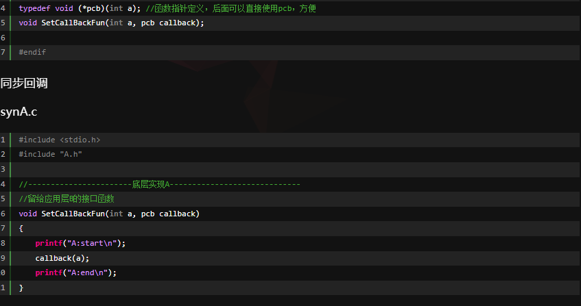


异步：


#### dynamic  cast

```c
dynamic_cast  //将基类指针安全的转换为子类指针，转换后可以访问子类的特有的方法和变量
```

子类转换为父类可以直接转换，不用cast，本来就是安全的


**父类指针只能访问父类的成员变量和函数，不能访问子类特有的成员变量和函数**

```c
static_cast //静态转换，不能保证运行 时类型转换是正常的，比如父类指针转向子类指针不一定正确，不安全
```


NULL指向地址为0的内存区域，而不是什么都不指向


#### typeid

**typeid如果参数是指针，判断指针指向的类型是不是一样**

int*  那类型就是int，看定义的时候


```c
#include <iostream>
#include <typeinfo>

class Base {
public:
    virtual void foo() {}
};

class Derived : public Base {
public:
    void foo() override {}
};

int main() {
    Base* basePtr = new Derived();

    // 使用typeid获取指针的类型信息
    const std::type_info& type = typeid(*basePtr);

    // 使用type_info的成员函数获取类型信息
    std::cout << "Type name: " << type.name() << std::endl;
    std::cout << "Hash code: " << type.hash_code() << std::endl;

    delete basePtr;

    return 0;
}

```


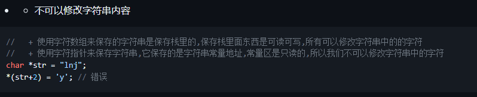

**字符数组在栈中，可读可写**

**字符串指针在常量区，可读不能写**


**数组名的地址不可更改**


**二级指针做函数参数，只需要将地址传入即可，和几级指针无关**

#### epoll

**水平触发(默认）：在高电平时，会不断的读取数据，这样就会造成效率降低**


**边缘触发：在wait后，会一直阻塞等待**


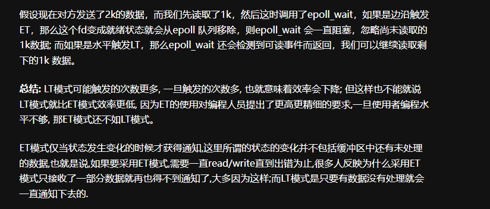

**水平触发通俗来讲：只要有数据，epoll_wait函数就一直返回；边沿触发通俗来讲：只有socket状态发生变化，epoll_wait函数才会返回。**


**将epollid和监听的fd绑定在一起，event包括监听的事件以及发生监听事件的fd**

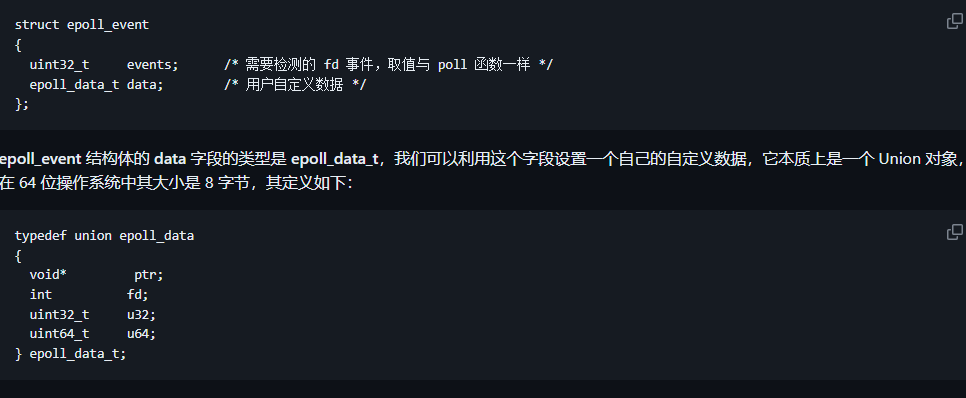


**调用该函数则会返回触发事件的fd，fd保存在event中**

#### boost的asio

**异步编程**


#### 构造函数不可缺失的情况

**注意：当类初始化参数有const、引用等，构造函数不可省略**


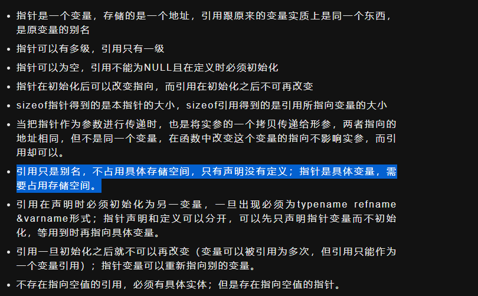

**指针作为函数参数传递，是把地址拷贝了一份，形参和实参是两个不同的变量**


**形参都是值传递**


**&a代表数组指针，a代表指针的首地址，指针+1代表移动指针指向类型的一个元素的大小**

**数组名是常指针，不能自增。数组名理解为首地址，不是指针**


**必须用初始化列表的都是一般不会改变的变量或函数，例如引用类型、const修饰的变量**


**RAII即为：将资源的获取和初始化与对象的生命周期绑定**

**简单理解：类中构造函数申请资源，析构函数释放资源**


#### 信号

**信号本质是一个软中断**


**信号来了以后，会中断当前程序的执行，去执行信号处理程序，然后再返回回来执行主程序	**


**raise函数给自己发送信号**


**信号集操作，会包含很多信号**

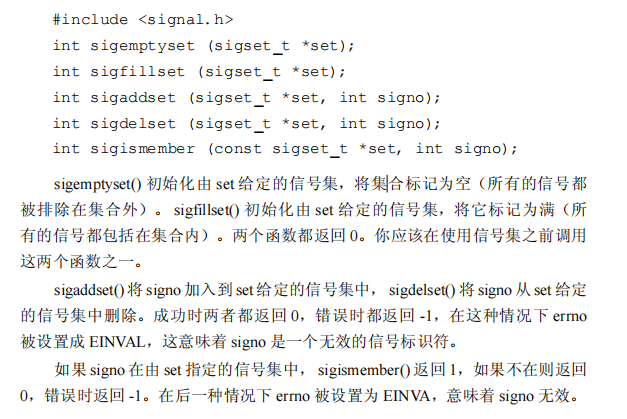

**sigprocmask会暂时的阻塞信号，不去中断正在的程序去处理信号**


**下面这两个信号无法阻塞**


```c
#include <signal.h>

/*
 * signum：信号编号
 * act：如果非 NULL，则信号 signum 被安装到 act 中
 * oldact：如果非 NULL，则旧的信号被保存到 oldact 中
 * return：成功返回 0，失败返回 -1，并设置 erron
 */
int sigaction(int signum, const struct sigaction *act, struct sigaction *oldact);

// 用 sigaction 结构取代了单一的 sighandler_t 函数指针
struct sigaction {
	void     (*sa_handler)(int); // 信号处理函数
	void     (*sa_sigaction)(int, siginfo_t *, void *);	// 另一种替代的信号处理函数
	sigset_t   sa_mask;  // 指定了应该被阻塞的信号掩码
	int        sa_flags; // 指定一组修改信号行为的标志
	void     (*sa_restorer)(void); // 应用程序不是使用这个成员
};
```


```c
#include <stdio.h>
#include <unistd.h>
#include <signal.h>

// 信号处理函数
void sig_handler(int sig_no) {
	if (SIGINT == sig_no)
		printf("\nGet (Ctrl - C)SIGINT\n");
	else if (SIGQUIT == sig_no)
		printf("\nGet (Ctrl - \\)SIGQUIT\n");
	else
		;// do nothing...
}

int main() {
	printf("wait for signal...\n");
	// Ctrl - C
	signal(SIGINT, sig_handler);

	// Ctrl - '\'
	signal(SIGQUIT, sig_handler);

	pause();
	return 0;
}

////上下两段代码等价

#include <stdio.h>
#include <unistd.h>
#include <signal.h>
#include <stdlib.h>
#include <string.h>

void sig_handler(int sig_no) {
	if (SIGINT == sig_no)
		printf("\nGet (Ctrl - C)SIGINT\n");
	else if (SIGQUIT == sig_no)
		printf("\nGet (Ctrl - \\)SIGQUIT\n");
	else
		;// do nothing...
}

int main() {
	printf("wait for signal...\n");

	struct sigaction act;

	// 初始化信号结构
	memset(&act, 0, sizeof(act));
	// 设置信号处理函数
	act.sa_handler = sig_handler;

	// 注册 SIGINT 信号
	if (sigaction(SIGINT, &act, NULL) < 0) {
		perror("sigaction");
		exit(1);
	}

	// 注册 SIGQUIT 信号
	if (sigaction(SIGQUIT, &act, NULL) < 0) {
		perror("sigaction");
		exit(1);
	}

	pause();
	return 0;
}

```

**可重入函数：可以被中断的函数**

**可重入函数是线程安全的，不会发生竞态条件**


**信号集中每一个信号都有一个标志，来表示是否被阻塞**


**sigprocmask可以将set的信号从已有的阻塞信号集加入或删除   SIG_BLOCK就是阻塞，SIG_UNBLOCK解除阻塞**


```c
void sig_alarm(int signo){
    printf("received SIGALRM\n");
    return;
}
void signal_set_fun(){
    sigset_t sigset;
    sigemptyset(&sigset);
    sigaddset(&sigset,SIGALRM);
    if(sigprocmask(SIG_BLOCK,&sigset,NULL)<0){///第三个参数，如果不知道就设置为NULL
        printf("sigprocmask error:\n");
    }
    if(signal(SIGALRM,sig_alarm) < 0){
        printf("signal error:\n");
    }
    alarm(2);
    sleep(4);
    printf("before unblock sigprocmask\n");
    if(sigprocmask(SIG_UNBLOCK,&sigset,NULL)<0){
        printf("sigprocmask unblock error:\n");
    }
 
}
```

**在上面的程序文件中先调用 sigprocmask 设置阻塞信号 SIGALRM,然后调用 alarm(2) 设置一个两秒钟的闹钟(两秒钟之后将向当前进程产生一个 SIGALRM 信号)。在睡眠 4 秒钟之后(此时应该已经产生了 SIGALRM 信号),调用 sigprocmask 函数解除对信号SIGALRM 的阻塞。**

**正常会等待4秒后，才会打印输出，这是因为解除屏蔽信号**


**sigpending函数获取当前进程处于等待状态的信号，是一个动态的过程**


```c
void alarm_is_pending(char *str){
    sigset_t pendingsig;
    printf("%s:\n",str);
    if(sigpending(&pendingsig) < 0){
        printf("sigpending required error:\n");
    }
    if(sigismember(&pendingsig,SIGALRM)){
        printf("SIGALRM is pending\n");
    }
    else{
        printf("SIGALRM is not pending\n");
    }
}

void signal_pending_fun(){
    sigset_t sigset;
    sigemptyset(&sigset);
    sigaddset(&sigset,SIGALRM);
    if(sigprocmask(SIG_BLOCK,&sigset,NULL) < 0){
        printf("sigprocmask error:\n");
    }
    alarm_is_pending("before alarm");
    alarm(2);
    sleep(4);
    alarm_is_pending("after alarm");
    exit(0);
}
```


**函数回调**

**函数回调出入被回调函数的地址**


#### 多线程深入


**call_once同一时刻只能有一个线程执行完该函数**


#### memcpy复制字符串

**memcpy复制字符串复制的是指向的地址，是浅拷贝**

https://blog.csdn.net/ySh_lC/article/details/120438357


**在声明时就会被静态分配内存**


**对于指针数组，只会分配数组的大小，具体指针指向的内存区域没有分配**


**具体的常量值会被存放在静态常量区中，会自动分配内存**

**指针作为参数传递，其实传递的是地址值**


**git merge类似于两个分支合并，不会改变节点的位置，从哪里分 开，最后汇合到一个节点，不会改变的节点的内容，比较安全**

**cherry-pick是去合并部分功能，merge是把全部功能都合并了**

**rebase是从两个分支的公共节点开始，提取到待变基的提交，移植到基底的分支后，这个比较复杂，修改了节点**


在常量池中


**在堆上得用户自己管理**

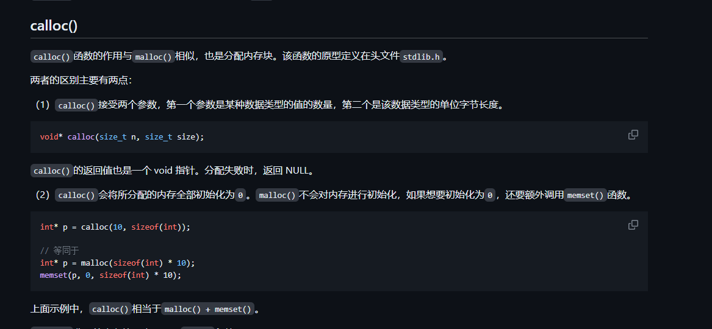

calloc= malloc +memset


#### 指针复习

指针的加减，一定是比较的是指向的数据单位

指针比较，比较的是内存的大小

**切记：sizeof里面是指针，就8个字节**


**数组名既可以代表整个数组，也可以代表首地址**

**字符指针，在声明时，就已经指向一块内存，后续不可以再进行修改**

****

**数组名一旦声明，作为地址，不能指向其他内存区域，因为它就是一个固定指针，总结，函数名和数组名都是常量指针**


**宏不是变量，一旦定义了，就不能改变，宏是完全替换**


上面的只是标识符，不代表字符串


**对于数组a, a+1指向下一个元素，如果&a+1，则指向整个数组最后一个元素的下一个元素，因为指针+1，1代表一个数据单位，由指针决定，&a代表的就是整个数组的内存**

**对于二维数组，a，&a[0][0],a[0]，代表的都是第一个元素的地址，但是&a【0】【0】+1指向下一个元素，a[0]+1指向下一行，a+1指向数组最后一个元素的下一个元素**


**引用指向的同一块内存，必须及时初始化**


**函数传参数，传递引用，更好的改变内存**

**C/C++中new出来的对象必须通过指针对象来引用它**

#### 虚函数指针和虚函数表

**c++通过虚函数表实现动态绑定，实现多态**


**虚函数表的变化在编译时候发生，根据类的声明改变**

**虚函数表本质是一个指针数组，数组元素是指向虚函数的函数指针，如下图所示：**


**一个类拥有一个虚表即可，如果一个类有多个对象，则每一个对象都有一个虚表指针，指向一个虚表，如图所示**


**动态绑定的原理：**

```c++
class A {
public:
    virtual void vfunc1();
    virtual void vfunc2();
    void func1();
    void func2();
private:
    int m_data1, m_data2;
};
class B : public A {
public:
    virtual void vfunc1();
    void func1();
private:
    int m_data3;
};
class C: public B {
public:
    virtual void vfunc2();
    void func2();
private:
    int m_data1, m_data4;
};
```


**如图所示：如果B继承A，则如果B重写了A的虚函数vfunc1，则其虚函数表会指向重写后的vfunc1，vfunc2没有重写，则指向A类虚表的vfunc2**

#### unique ptr


#### makefile


**先展开后赋值**


#### unique_lock


```c++
#include <iostream>
#include <thread>
#include <mutex>

std::mutex mtx;

void func1() {
    std::unique_lock<std::mutex> lock(mtx, std::defer_lock);  // 延迟加锁，后边自己加锁
    // ...
    lock.lock();  // 手动加锁
    // 使用锁保护的临界区
    lock.unlock();  // 解锁
    // ...
}

void func2() {
    std::unique_lock<std::mutex> lock(mtx, std::try_to_lock);  // 尝试加锁
    if (lock.owns_lock()) { ///当前对象是否有锁
        // 成功获取到锁
        // 使用锁保护的临界区
    }
    // ...
}

void func3() {
    mtx.lock();
    std::unique_lock<std::mutex> lock(mtx, std::adopt_lock);  // 已拥有锁，mutex提前已经上锁
    // 使用锁保护的临界区
    mtx.unlock();
    // ...
}

int main() {
    std::thread t1(func1);
    std::thread t2(func2);
    std::thread t3(func3);

    t1.join();
    t2.join();
    t3.join();

    return 0;
}

```

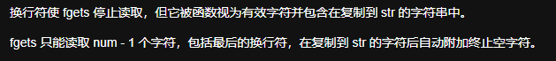

**以后用****scanf，不用fget**


**getchar是从缓冲区提取字符的，会清空缓冲区，getchar一下，一个字符就会被清空，功能类似于fflush（stdin）**


**全局/静态区（默认初始化）：存放静态变量、常变量、字符串常量**


**简单来说：reactor是同步io，proactor是异步io**


**如果不使用virtual，则为静态绑定**


**和fork的区别是：会复制一个新的进程，而fork是共用**


#### socket的阻塞和非阻塞

**send和recv只是从内核缓冲区和应用缓冲区读取数据，并没有真正的发送**


**如果是阻塞式：会一直阻塞在那个位置，如果是非阻塞式，会立刻返回错误**


#### C语言的栈调用

**帧栈是向下增长，地址从上到下，逐渐变小。**

**帧栈是一个倒立的栈**


#### 位运算

**左移不分符号位，空位补0，即可**

**右移：空位根据符号位来补**

**如果是正数，补0。如果是负数，补1**


#### constexpr

**constexpr修饰的变量和表达式在编译时就可以求值，与宏定义不同的是有类型、语法检查**

**可提高代码质量**


#### stl的原理

**六大组件的示意图：**


**dequeue保存map，包含很多节点，一个节点就是一个指针，指向一块缓存区，这是存储的具体地方**


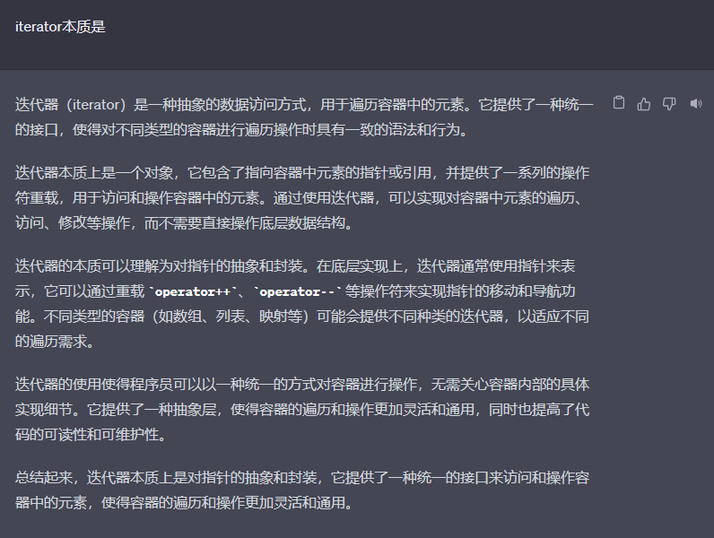

**iterator本质是对指针、引用的包装**

#### 面向对象

**静态成员变量可以声明在类内部，但初始化必须在外面**


**如果类包含指针，那么指针的大小不好预判，静态大小只有指针的大小**


**全局变量都在全局区**

#### Traits技术

**traits是解决原生指针和iterator不一致的问题**


**如果是修改参数，就传递引用类型**


**虚函数的调用需要this->vptr,所以不能被static修饰，this指针是跟着对象走，对象对成员函数或变量的访问都是通过this实现的，如果没写，省略**

#### 位运算

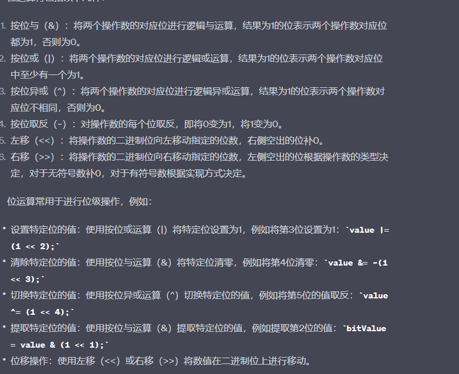

**临界区是访问共享数据的代码块**

#### select


**上述三个fd的集合会保存最后查询出来的fd**

**select函数会返回上述三个集合的fd数量**

**fd集合的最大容量通常为1024**

```c
#include<stdio.h>
int main()
{
	int sockfd=sockfd();
	bind(socket);
	listen(socket);	
	fd_set rest;
	fd_set allset;//allset 只做添加fd 不在select进行改变
	int allfd[1024]={0};//把客服端同时也放入数组 
	int count =0;
		
	//把socket（把服务器文件描述符）放入集合
      FD_SET(socket,&rset);
	FD_SET(socket,&allset);
	while(1)
	{
		reset=allset;//保证每次循环 select能监听所有的文件描述符
		//在这里等 等rset里面有动静
		select(100,&rest,NULL,NULL,NULL); 
		if(FD_ISSET(socket,&rset))   //可能1 产生新链接
		{
			int confd=accept(socket);//accept你做等待
			//connfd 是用来通信 read write
			FD_SET(confd,&allset);
			allfd[count]=connfd;
			count++;
		}
		else                         //可能2 旧客服端发来消息
		{
			for(int i=0;i<=count;i++)//把数组元素循环取出集合是否存在
			{
				if(FD_ISSET(allfd[i],&rset))
				{
					if conn=allfd[i];//找到了产生动静的fd
					break；
						
				}
			}			
		}		
	}		
}

```


**其中pollfd保留fd，以及我们期待的事件，revents代表实际发生的事件**

**返回值为处于就绪态的fd数量，与select相比，去除重复了**

**如何定义就绪态：即io不会阻塞就是就绪，不管能不能传输数据**


**信号驱动**

**利用fcntl函数**

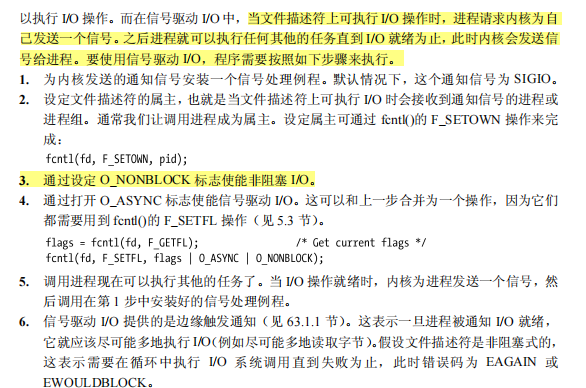

#### 信号量


#### va list


```c
#include <stdio.h>

void resumeDownload()
{
    const char* sourceFilePath = "source.txt";
    const char* targetFilePath = "target.txt";

    FILE* sourceFile = fopen(sourceFilePath, "rb");
    FILE* targetFile = fopen(targetFilePath, "ab+");

    if (sourceFile && targetFile)
    {
        // 获取源文件大小
        fseek(sourceFile, 0, SEEK_END);
        long sourceFileSize = ftell(sourceFile);

        // 获取已下载的字节数
        fseek(targetFile, 0, SEEK_END);
        long downloadedBytes = ftell(targetFile);

        // 定位到断点位置
        fseek(sourceFile, downloadedBytes, SEEK_SET);
        fseek(targetFile, downloadedBytes, SEEK_SET);

        // 开始继续下载并写入目标文件
        char buffer[1024];
        size_t bytesRead = 0;
        while ((bytesRead = fread(buffer, 1, sizeof(buffer), sourceFile)) > 0)
        {
            fwrite(buffer, 1, bytesRead, targetFile);
        }

        // 下载完成后关闭文件句柄
        fclose(sourceFile);
        fclose(targetFile);

        printf("Download completed.\n");
    }
    else
    {
        printf("Failed to open files.\n");
    }
}

int main()
{
    resumeDownload();

    return 0;
}

```


**auto在初始化时推到出类型，数组的类型声明就确定了，无法通过初试化来推到出来**


**槽就是处理信号的函数**


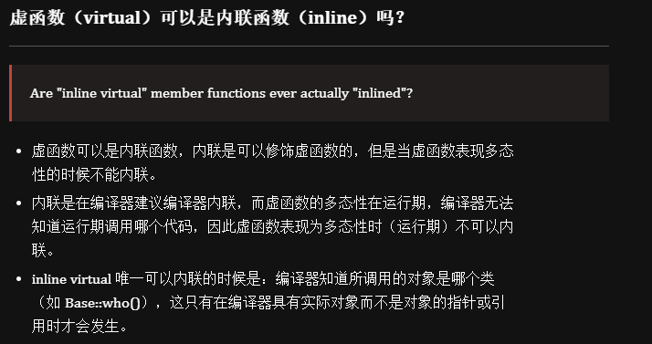

```c
#include <iostream>
using namespace std;
class Base
{
public:
	inline virtual void who()
	{
		cout << "I am Base\n";
	}
	virtual ~Base() {}
};
class Derived : public Base
{
public:
	inline void who()  // 不写inline时隐式内联
	{
		cout << "I am Derived\n";
	}
};

int main()
{
	// 此处的虚函数 who()，是通过类（Base）的具体对象（b）来调用的，编译期间就能确定了，所以它可以是内联的，但最终是否内联取决于编译器。
	Base b;
	b.who();

	// 此处的虚函数是通过指针调用的，呈现多态性，需要在运行时期间才能确定，所以不能为内联。
	Base *ptr = new Derived();
	ptr->who();

	// 因为Base有虚析构函数（virtual ~Base() {}），所以 delete 时，会先调用派生类（Derived）析构函数，再调用基类（Base）析构函数，防止内存泄漏。
	delete ptr;
	ptr = nullptr;

	system("pause");
	return 0;
}
```


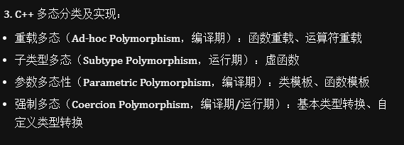


```c
class Shape
{
public:
    Shape();                    // 构造函数不能是虚函数
    virtual double calcArea();
    virtual ~Shape();           // 虚析构函数
};
class Circle : public Shape     // 圆形类
{
public:
    virtual double calcArea();
    ...
};
int main()
{
    Shape * shape1 = new Circle(4.0);
    shape1->calcArea();
    delete shape1;  // 因为Shape有虚析构函数，所以delete释放内存时，先调用子类析构函数，再调用基类析构函数，防止内存泄漏。
    shape1 = NULL;
    return 0；
}
```

**构造函数不可以是虚函数，析构函数可以说虚函数**


#### 多线程的TCP

**最关键的是主线程将监听到的fd，传递到子线程，子线程利用该fd'进行读取数据**


```C
#include <stdio.h>
#include <stdlib.h>
#include <unistd.h>
#include <string.h>
#include <arpa/inet.h>
#include <pthread.h>

struct SockInfo
{
    int fd;                      // 通信
    pthread_t tid;               // 线程ID
    struct sockaddr_in addr;     // 地址信息
};

struct SockInfo infos[128];

void* working(void* arg)
{
    while(1)
    {
        struct SockInfo* info = (struct SockInfo*)arg;
        // 接收数据
        char buf[1024];
        int ret = read(info->fd, buf, sizeof(buf));
        if(ret == 0)
        {
            printf("客户端已经关闭连接...\n");
            info->fd = -1;
            break;
        }
        else if(ret == -1)
        {
            printf("接收数据失败...\n");
            info->fd = -1;
            break;
        }
        else
        {
            write(info->fd, buf, strlen(buf)+1);
        }
    }
    return NULL;
}

int main()
{
    // 1. 创建用于监听的套接字
    int fd = socket(AF_INET, SOCK_STREAM, 0);
    if(fd == -1)
    {
        perror("socket");
        exit(0);
    }

    // 2. 绑定
    struct sockaddr_in addr;
    addr.sin_family = AF_INET;          // ipv4
    addr.sin_port = htons(8989);        // 字节序应该是网络字节序
    addr.sin_addr.s_addr =  INADDR_ANY; // == 0, 获取IP的操作交给了内核
    int ret = bind(fd, (struct sockaddr*)&addr, sizeof(addr));
    if(ret == -1)
    {
        perror("bind");
        exit(0);
    }

    // 3.设置监听
    ret = listen(fd, 100);
    if(ret == -1)
    {
        perror("listen");
        exit(0);
    }

    // 4. 等待, 接受连接请求
    int len = sizeof(struct sockaddr);

    // 数据初始化
    int max = sizeof(infos) / sizeof(infos[0]);
    for(int i=0; i<max; ++i)
    {
        bzero(&infos[i], sizeof(infos[i]));
        infos[i].fd = -1;
        infos[i].tid = -1;
    }

    // 父进程监听, 子进程通信
    while(1)
    {
        // 创建子线程
        struct SockInfo* pinfo;
        for(int i=0; i<max; ++i)
        {
            if(infos[i].fd == -1)
            {
                pinfo = &infos[i];
                break;
            }
            if(i == max-1)
            {
                sleep(1);
                i--;
            }
        }

        int connfd = accept(fd, (struct sockaddr*)&pinfo->addr, &len);
        printf("parent thread, connfd: %d\n", connfd);
        if(connfd == -1)
        {
            perror("accept");
            exit(0);
        }
        pinfo->fd = connfd;
        pthread_create(&pinfo->tid, NULL, working, pinfo);
        pthread_detach(pinfo->tid);
    }

    // 释放资源
    close(fd);  // 监听

    return 0;
}
```

#### 多进程


**利用SIGCHLD信号，当子进程退出后，会通知父进程，父进程会调用callback函数，利用waitpid来回收子进程**

**waitpid函数会等待子进程的状态变化，并返回子进程的退出状态，如果返回正值，则代表正常退出，如果是-1代表异常退出**


****

```c
#include <stdio.h>
#include <stdlib.h>
#include <unistd.h>
#include <string.h>
#include <arpa/inet.h>
#include <signal.h>
#include <sys/wait.h>
#include <errno.h>

// 信号处理函数
void callback(int num)
{
    while(1)
    {
        ///-1代表任意子进程，WNOHANG非阻塞
        pid_t pid = waitpid(-1, NULL, WNOHANG);
        if(pid <= 0)
        {
            printf("子进程正在运行, 或者子进程被回收完毕了\n");
            break;
        }
        printf("child die, pid = %d\n", pid);
    }
}

int childWork(int cfd);
int main()
{
    // 1. 创建监听的套接字
    int lfd = socket(AF_INET, SOCK_STREAM, 0);
    if(lfd == -1)
    {
        perror("socket");
        exit(0);
    }

    // 2. 将socket()返回值和本地的IP端口绑定到一起
    struct sockaddr_in addr;
    addr.sin_family = AF_INET;
    addr.sin_port = htons(10000);   // 大端端口
    // INADDR_ANY代表本机的所有IP, 假设有三个网卡就有三个IP地址
    // 这个宏可以代表任意一个IP地址
    // 这个宏一般用于本地的绑定操作
    addr.sin_addr.s_addr = INADDR_ANY;  // 这个宏的值为0 == 0.0.0.0
    //    inet_pton(AF_INET, "192.168.237.131", &addr.sin_addr.s_addr);
    int ret = bind(lfd, (struct sockaddr*)&addr, sizeof(addr));
    if(ret == -1)
    {
        perror("bind");
        exit(0);
    }

    // 3. 设置监听
    ret = listen(lfd, 128);
    if(ret == -1)
    {
        perror("listen");
        exit(0);
    }

    // 注册信号的捕捉
    struct sigaction act;
    act.sa_flags = 0;
    act.sa_handler = callback;
    sigemptyset(&act.sa_mask);
    sigaction(SIGCHLD, &act, NULL);

    // 接受多个客户端连接, 对需要循环调用 accept
    while(1)
    {
        // 4. 阻塞等待并接受客户端连接
        struct sockaddr_in cliaddr;
        int clilen = sizeof(cliaddr);
        int cfd = accept(lfd, (struct sockaddr*)&cliaddr, &clilen);
        if(cfd == -1)
        {
            if(errno == EINTR)
            {
                // accept调用被信号中断了, 解除阻塞, 返回了-1
                // 重新调用一次accept
                continue;
            }
            perror("accept");
            exit(0);
 
        }
        // 打印客户端的地址信息
        char ip[24] = {0};
        printf("客户端的IP地址: %s, 端口: %d\n",
               inet_ntop(AF_INET, &cliaddr.sin_addr.s_addr, ip, sizeof(ip)),
               ntohs(cliaddr.sin_port));
        // 新的连接已经建立了, 创建子进程, 让子进程和这个客户端通信
        pid_t pid = fork();
        if(pid == 0)
        {
            // 子进程 -> 和客户端通信
            // 通信的文件描述符cfd被拷贝到子进程中
            // 子进程不负责监听
            close(lfd);
            while(1)
            {
                int ret = childWork(cfd);
                if(ret <=0)
                {
                    break;
                }
            }
            // 退出子进程
            close(cfd);
            exit(0);
        }
        else if(pid > 0)
        {
            // 父进程不和客户端通信
            close(cfd);
        }
    }
    return 0;
}


// 5. 和客户端通信
int childWork(int cfd)
{

    // 接收数据
    char buf[1024];
    memset(buf, 0, sizeof(buf));
    int len = read(cfd, buf, sizeof(buf));
    if(len > 0)
    {
        printf("客户端say: %s\n", buf);
        write(cfd, buf, len);
    }
    else if(len  == 0)
    {
        printf("客户端断开了连接...\n");
    }
    else
    {
        perror("read");
    }

    return len;
}
```

**waitpid实例：status可以返回子进程正常退出的原因**

```c
#include <stdio.h>
#include <sys/types.h>
#include <sys/wait.h>
#include <unistd.h>

int main() {
    pid_t pid = fork();
    
    if (pid == -1) {
        perror("fork");
        return 1;
    } else if (pid == 0) {
        // 子进程
        printf("Child process, PID: %d\n", getpid());
        sleep(2);  // 模拟子进程执行一段时间
        return 42;
    } else {
        // 父进程
        int status;
        pid_t terminated_pid = waitpid(pid, &status, 0);
        
        if (terminated_pid == -1) {
            perror("waitpid");
            return 1;
        }
        
        if (WIFEXITED(status)) {
            printf("Child process terminated normally with status: %d\n", WEXITSTATUS(status));
        } else if (WIFSIGNALED(status)) {
            printf("Child process terminated due to signal: %d\n", WTERMSIG(status));
        }
        
        printf("Parent process, PID: %d\n", getpid());
        return 0;
    }
}

```

#### linux的进程

**fork代表创建一个新的进程，子进程和父进程占用同一块内存区域，exec是将二进制文件加载到内存运行，并替换原有的地址空间，相当于运行一个进程**

**fork后的子进程会完全继承父进程的互斥锁，pthread_atfork函数去处理父进程和子进程的互斥锁**


**l代表list，v代表vector，p代表在PATH路径下找文件，e代表提供新的环境变量**


**写时复制，在fork后，只有在对某一个资源写的时候，才会复制一份新的，如果是读资源，父进程和子进程共享资源**


**子进程在父进程之前结束，会保留一小块信息，当父进程查询后，该信息就会消失，子进程会完全消失**


#### 创建守护进程

**守护进程必须是init的子进程**


 

**sched_yield主动让出当前进程的执行**


**文件write只能保证数据写入到内核缓冲区，无法保证写入到磁盘文件，需要fsync() 和 fdatasync(）来同步**


**fwrite是按流写文件，而write'是按整字节写入，流写入可以是一部分一部分写入**

#### 原子操作的内存顺序

```c
/**
 *  memory_order_relaxed: 没有顺序约束，可以产生最高的性能，但对于同一原子变量的多次读写操作之间没有同步，可能会导致数据不一致。
    memory_order_acquire: 即当前线程等其他进程读完之后，再读，这样能保证是读取最新的值
    memory_order_release: 确保当前数据的写操作对其他进程可见
    memory_order_acq_rel: 综合了 memory_order_acquire 和 memory_order_release
    memory_order_seq_cst: 顺序一致性，是最强的内存顺序，对于所有线程来说，原子操作的顺序是完全一致的，保证了所有的内存访问顺序。
 */
```

#### reactor，proactor的区别


**reactor是同步：reactor会去监听所有的io事件，如果就绪，则通知应用去处理io事件**

**proactor是异步：proactor，既有监听也有处理事件的程序，io事件就绪后，会自己处理好后，通知应用，不用应用自己处理**

**关键在于：reactor需要应用自己处理事件，而proactor不需应用处理**


#### C语言的内存区域

**栈是会自动释放内存的**


**.rel.text和.rel.data相当于代码和变量的重定位信息**


#### 僵尸进程等特殊进程

**不用wait函数，就会出现僵尸进程**


**孤儿进程虽然保留之前的会话关系，但已经不起任何作用了**


**僵尸进程和孤儿进程都被init/systemd处理**


#### 信号


#### 内存对齐

原则：

1、**当前行字节大小+之前的字节大小一定是下一个字节的整数倍，否则补齐，补齐单字节，最大为4或8，即使不补也不能超出4或8**

2、**结构体整体的大小是最宽字节的整数倍，4或8**


#### char *str1 = "hello world" 和 char str2[] = "hello world"的理解

**str1 是指针变量**

**str2是数组名字，是一个指针常量，在栈上分配内容，其值可以改变**


#### this

**this是常指针，不能被赋值，被const修饰**


#### C语言的不足


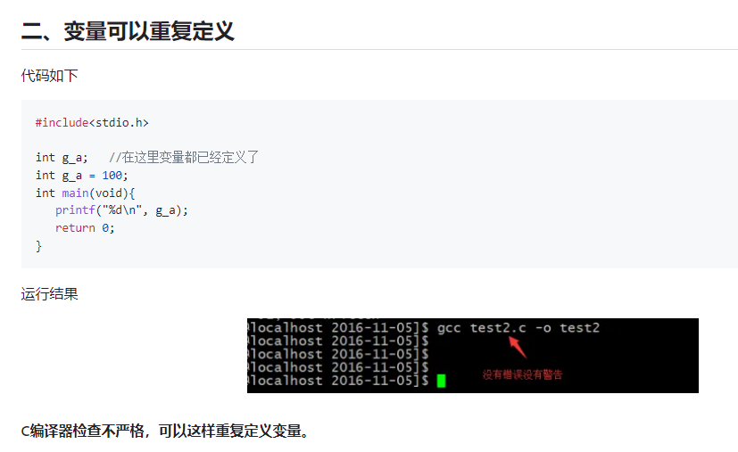


#### IPC总结


#### IO多路复用


**select的返回是那三个集合，里面是已经ready的fd**

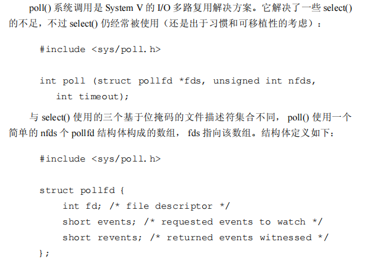


**简单来说poll中的event会设置观察的事件类型，比如，是否可读或者是否可写。内核会在revent返回这个fd是不是可读或者可写的，相当于标记了fd的发生的事件类型**


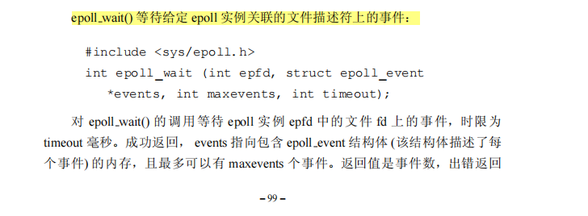

#### 回调函数


**回调函数：一个可以通过函数指针调用的函数**

#### vfork


**vfork和fork的区别：子进程与父进程共享地址空间，同时，子进程先于父进程运行**

#### makefile


[参考makefile的教程](https://seisman.github.io/how-to-write-makefile/Makefile.pdf)


**利用+=来为变量追加值**


**=赋值方式，可以使用变量后面定义的值，但是：=只能使用变量在前面定义的值**


**字符串替换函数**


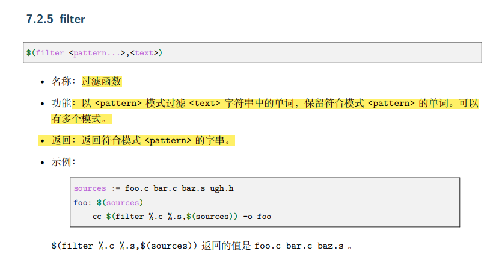


**通过伪目标可以生成一系列文件**


**隐式规则：一些约定俗成的规则，比如要用.c文件生成.o文件**


#### 四种转换


#### 前置声明

**仅当两个类相互包含对方时，使用前置声明，且只能使用指针和 引用**

**前置声明后，该类只是一个不完全类型，只能定义指向该类的引用或指针，只知道是这么一个类型，不知道内部包含声明东西，所以不能很具体的表示，只能用指针**


#### 硬链接和软连接

**硬链接：是不同的文件名指向同一个inode，指向文件索引节点的指针**


**软连接：-s**

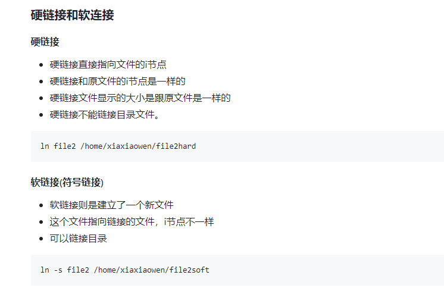

#### git

http://marklodato.github.io/visual-git-guide/index-zh-cn.html

**merge是相当于三方合并（main分支最新提交、other分支的最新提交、main和other分支的公共祖先），合并后形成新的节点，并移动HEAD**

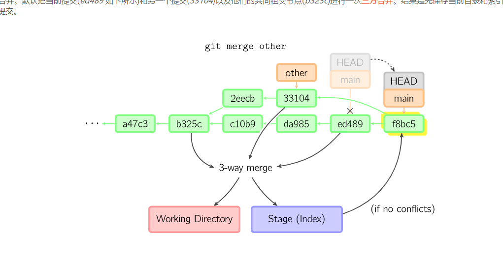

**cherrypick：相当于复制一个提交节点，并形成一个新的提交**


**rebase相当于：在当前main分支，将other的提交节点复制过去**


**git pull是fetch和merge的合体**

#### weak_ptr


#### 仿函数

**仿函数即为函数对象，本质就是类中有一个 operator ()重载函数，如下图所示**

**以下代码为c++源码：**

```cpp
/// One of the @link arithmetic_functors math functors@endlink.
  template<typename _Tp>
    struct plus : public binary_function<_Tp, _Tp, _Tp>
    {
      _GLIBCXX14_CONSTEXPR
      _Tp
      ///重写（），相当于重载
      operator()(const _Tp& __x, const _Tp& __y) const
      { return __x + __y; }
    };


template<typename _Tp> struct _Identity<const _Tp> : _Identity<_Tp> { };

  template<typename _Pair>
    struct _Select1st
    : public unary_function<_Pair, typename _Pair::first_type>
    {
      typename _Pair::first_type&
      operator()(_Pair& __x) const
      { return __x.first; }

      const typename _Pair::first_type&
      operator()(const _Pair& __x) const
      { return __x.first; }

#if __cplusplus >= 201103L
      template<typename _Pair2>
        typename _Pair2::first_type&
        operator()(_Pair2& __x) const
        { return __x.first; }

      template<typename _Pair2>
        const typename _Pair2::first_type&
        operator()(const _Pair2& __x) const
        { return __x.first; }
#endif
    };
```


#### 类的大小

**成员函数大小不算其中**


#### TCP是流式协议


#### epoll

**epoll将用户关心的事件存在内核的事件表，不像poll或select不断的从用户态拷贝内核**

**epoll_create函数创建一个fd，指向该内核事件表**


```cpp
#include <stdio.h>
#include <stdlib.h>
#include <string.h>
#include <netinet/in.h>
#include <arpa/inet.h>
#include <sys/epoll.h>
#include <errno.h>
#include <string.h>
#include <stdio.h>
#include <unistd.h>
#define MAXLINE 80
#define SERV_PORT 8000 //端口号
#define OPEN_MAX 1024  //最多连接数


int main(int argc,char *argv[])
{	
	int maxi,sockfd,connfd;//sockfd 用来监听 connfd用来连接的· 监听套接字要自己创建  连接套接字等待返回就行不需要socket
	int nready,efd; //efd是 epoll模型标识符 nready 产生的动静数
	struct sockaddr_in clientaddr, serveraddr;
	struct epoll_event event, events[OPEN_MAX]; //一个果篮 一个结构体
	
    sockfd = socket(AF_INET, SOCK_STREAM, 0);
    bzero(&serveraddr, sizeof(serveraddr));
	bzero(&clientaddr, sizeof(clientaddr));
    serveraddr.sin_family = AF_INET;
    serveraddr.sin_addr.s_addr = htonl(INADDR_ANY);
    serveraddr.sin_port = htons(SERV_PORT);
	int on =1;
	setsockopt(sockfd, SOL_SOCKET, SO_REUSEADDR, &on, sizeof(on)) ;//设置为可重复使用的端口
    bind(sockfd, (struct sockaddr *) &serveraddr, sizeof(serveraddr));
    listen(sockfd, OPEN_MAX);//服务器套接字
	efd=epoll_create(OPEN_MAX);
	/*包装服务器fd为事件*/
	event.events=EPOLLIN|EPOLLET;
	event.data.fd=sockfd;
    epoll_ctl(efd,EPOLL_CTL_ADD,sockfd,&event);//把服务器fd包装成事件放在红黑树上	
    while(1)
	{
		//参数一 epollfd 参数二 产生ready事件的结构体数组 参数三 同时最多产生多少动静 参数四 超市时间
		nready=epoll_wait(efd,events,OPEN_MAX,-1);//返回值为就绪事件的数量
		for(int i=0;i<nready;i++)
		{        	
			if(!(events[i].events & EPOLLIN))//判断为可读事件 不是立刻返回循环 与select不同
				continue;
			if (events[i].data.fd==sockfd)//表示有新的连接
			{
				int len=sizeof(clientaddr);
				char ipstr[128];//打印用到
				connfd=accept(sockfd,(struct sockaddr *)&clientaddr,&len);
				printf("client ip%s ,port %d\n",inet_ntop(AF_INET,&clientaddr.sin_addr.s_addr,ipstr,sizeof(ipstr)),
					ntohs(clientaddr.sin_port));
				event.events = EPOLLIN|EPOLLET; 
				event.data.fd = connfd;  
				epoll_ctl(efd, EPOLL_CTL_ADD, connfd, &event);	//这是新的连接，要加入到监听事件的集合中	
			}
			else//表示旧的数据产生可读事件（1 客户端发来数据 2 客户端断开链接）
			{				
     			connfd=events[i].data.fd;
				char buf [1024];
				memset(buf,0,1024);
				int nread;			nread=read(connfd,buf,sizeof(buf));
				
				if(nread==0)
				{
					printf("client is close..\n"); //打印
					epoll_ctl(efd, EPOLL_CTL_DEL, connfd, NULL);//删除事件，该事件已经断开
					close(connfd);//关闭客服端 select一样
                }
				else
				{
					printf("%s",buf);
				}			
			}		
		}	
	}	
}

```

#### nagle算法


#### GDB


#### iterator


#### top命令


#### 编译时多态

**编译时多态：模板类和函数重载------本质一样：通过参数的不同选择不同的执行**


#### 文件操作的总结


**带write都是二进制操作**

下面C语言的操作

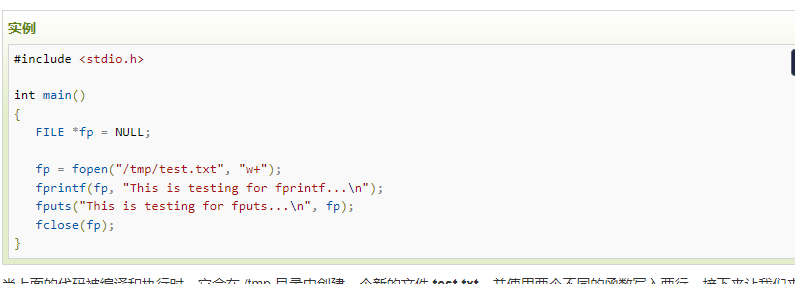


下面是c++的操作


#### 进程、线程、协程

**协程其实就是用户线程，用户通过自己设计来实现任务的切换，线程的实现需要库函数ucontext**


https://langzi989.github.io/tags/ucontext-t/


```C++
#include <stdio.h>
#include <ucontext.h>

static ucontext_t ctx[3];

static void func1(void)
{
    // 切换到func2
    swapcontext(&ctx[1], &ctx[2]);

    // 返回后，切换到ctx[1].uc_link，也就是main的swapcontext返回处
}
static void func2(void)
{
    // 切换到func1
    swapcontext(&ctx[2], &ctx[1]);

    // 返回后，切换到ctx[2].uc_link，也就是func1的swapcontext返回处
}

int main (void)
{
    // 初始化context1，绑定函数func1和堆栈stack1
    char stack1[8192];
    getcontext(&ctx[1]);
    ctx[1].uc_stack.ss_sp   = stack1;
    ctx[1].uc_stack.ss_size = sizeof(stack1);
    ctx[1].uc_link = &ctx[0];
    makecontext(&ctx[1], func1, 0);

    // 初始化context2，绑定函数func2和堆栈stack2
    char stack2[8192];
    getcontext(&ctx[2]);
    ctx[2].uc_stack.ss_sp   = stack2;
    ctx[2].uc_stack.ss_size = sizeof(stack1);
    ctx[2].uc_link = &ctx[1];
    makecontext(&ctx[2], func2, 0);

    // 保存当前context，然后切换到context2上去，也就是func2
    swapcontext(&ctx[0], &ctx[2]);
    return 0;
}
```


**操作系统并没有这样一个概念**

#### 内存溢出、内存泄露


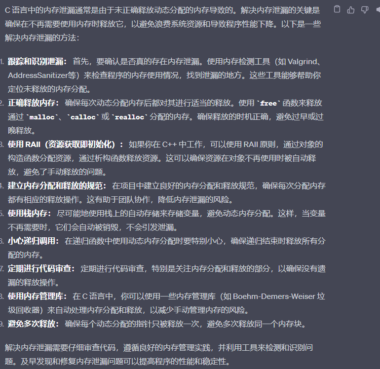

#### inode

**inode：就是保留文件索引信息的64位的信息表**


#### linux的进程状态


#### 编译过程及ELF格式


**可执行文件的结构**


**如下图所示，在main函数中，会先跳转到plt中查找地址，然后跳转到got的地址**


**静态库是在生成可执行文件前链接，静态库其实就是.o文件，动态库是可执行文件执行的时候链接**


#### #pragma

**#pragma是一种编译器指令，它的作用是设定编译器的状态或者是指示编译器完成一些特定的动作，保证C语言或c++与编译器保持兼容性**


#### stl的配接器


#### typename和class 的区别

**只有在嵌套依赖，必须用typename，告诉后续是一个类型，而不是一个成员变量**


**typename是提取类已经定义的参数类型**


#### 

#### 全特化和偏特化

**偏特化：特化部分参数**


**通过typename来萃取出iterator 的各种类型，这就是traits，其次通过偏特化对原生的指针（int*、char*)  ,推断出类型**


#### 二级空间配置器


#### 动态库加载过程


#### exec函数

**相当于替换进程空间，进程id不变**


#### fork函数


#### 系统调用

**最重要的生成系统调用表，后面紧跟实际的实现函数**


#### read系统调用


#### 文件描述符


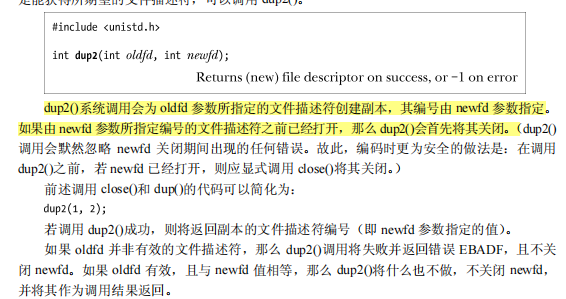

#### 中断


**硬中断是去中断cpu，触发操作系统内核的相对应的保护代码**

**软中断是cpu等待，让其他程序去处理io操作，当CPU接收到一个软件中断信号时，可能会暂时将控制切换到一个中断处理程序程序，内核中被中断挂起的进程(例如，一个程序的运行实例)将在中断被接受后恢复**

**二者唯一的区别是：软中断的处理程序是正在运行的进程调用的，硬中断是操作系统内核调用的**

#### 直接初始化和拷贝初始化

**拷贝初始化是需要一个对象来赋值初始化，直接初始化没有对象**


#### 默认参数和占位参数


**默认参数：可有可无**


**占位参数：必须要有**


#### new的三种用法

**new 一个对象时，会自动执行对象的构造函数，同时，delete会执行析构函数，但是malloc不能，只能分配大小**


**对于数组初始化，不能确定哪个数组元素该初始化，则利用placement  new**

```c++
#include <iostream>
#include <string.h>
#include <stdlib.h>
 
using namespace std;
 
 
class String
{
public:
	// 构造函数
	String(const char *str=NULL)
	{
		if (str == NULL)
		{
			data = new char[1];
			data[0] = '\0';
		}
		else
		{
			data = new char[sizeof(str) + 1];
			strcpy(data, str);
		}
		cout << "构造对象："<<this<<endl;
	} 
	
	// 析构函数
	~String()
	{
		delete [] data;	
		cout<<"析构对象："<<this<<endl; 
	} 
	
	// 初识化函数
	void initString(const char *str = NULL)
	{
		if (str == NULL)
		{
			data = new char[1];
			data[0] = '\0';
		}
		else
		{
			data = new char[sizeof(str) + 1];
			strcpy(data, str);
		}
		cout << "调用初识化函数"<<this<<endl;
	}
	
	
	// 释放数据函数 
	void freeString()
	{
		free(data);	
		cout << "free data"<<endl; 
	} 
	
private:
	char *data;
};
 
int main(void)
{
	String *p = new String[10];
	for (int i = 0; i < 10; ++i)
	{
		cout<<"第"<<i<<"次循环"<<endl;
        // 写法 new+指针+指针类型+初始化的值
        // 每次初始化都是调用构造函数初始化 
		new (p+i)String("haha");
	}
			
}
 
```

#### 阻塞和同步异步区别


**网络IO分两步：**

https://www.cyhone.com/articles/reunderstanding-of-non-blocking-io/

**1、等待远端的数据传来**

**2、从内核将数据拷贝到用户**

**阻塞和非阻塞：区分在等待数据传来，是否一直等**

**同步和异步：区分在拷贝数据时，是否一直等待数据复制好**

#### basic_string_view

****


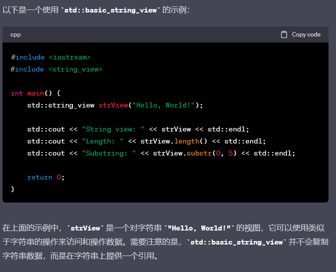

#### c++协程


#### variant 


#### void类型的指针

**void类型的指针只是隐藏了类型，该是什么类型还是什么类型**

**delete void类型的指针，必须先强转，因为不知道是哪种类型，无法调用析构函数释放指针指向的内存**

**但可以free void类型的指针**

#### 有名信号量和无名信号量的区别


**有名信号量是进程间互斥，无名信号量是线程间互斥**

#### const_cast用法


#### traits

**通过特化可以解决自定义类的内置数据类型推导的问题，但因为int、float等，无法推导内置数据类型**


**引入type_traits，然后通过模板特化，完成内置数据类型推导**

**templete模板编程只能推导出参数类型，无法推导出返回值类型**

**通过引入value_type内置声明，来解决无法推导出函数返回值的问题**

```cpp
template<typename T>
class MyIter {
public:
	 typedef T value_type; //内嵌类型声明
	 MyIter(T *p = 0) : m_ptr(p) {}
	 T& operator*() const { return *m_ptr;}
private:
	 T *m_ptr;
};

//以迭代器所指对象的类型作为返回类型
//注意typename是必须的，它告诉编译器这是⼀个类型
template<typename MyIter>
typename MyIter::value_type Func(MyIter iter) {
	return *iter; 
}

int main(int argc, const char *argv[]) {
	 MyIter<int> iter(new int(666));
	 std::cout<<Func(iter)<<std::endl; //print=> 666
}

```

**但上述代码中，原生基本数据类型，int等无法自定义内置类型，为解决该问题使用偏特化萃取**

```cpp
template<typename Iterator>
struct iterator_traits { //类型萃取机
 typedef typename Iterator::value_type value_type; //value_type 就是 Iterator 的类型型别，萃取机本质上提前推导出原生指针类型
    
}


///原生指针的偏特化版本
template <class I>
struct iterator_traits {
    typedef typename I::value_type value_type;
};

template <class T>
struct iterator_traits<T*> {
    typedef T value_type;
};

template <class T>
struct iterator_traits<const T*> {
    typedef T value_type;
};

```

#### ext3和ext2


#### 中断和异常区别

**中断：程序可以恢复后继续执行，而异常则不可以**


#### Netlink通信

**netlink是用户和内核通信机制，具体使用UDP机制，仅仅增加一个struct nlmsghdr**


#### rcu机制


#### socket缓冲区


**send是将数据复制到send buffer（发送队列），recv是将数据复制到recv buffer（接收队列），具体数据的发送是由操作系统决定的**


#### poll

```c
#include<stdio.h>
int main()
{
	int sockfd=sockfd();
	bind(socket);
	listen(socket);	
	fd_set rest;
	fd_set allset;//allset 只做添加fd 不在select进行改变
	int allfd[1024]={0};//把客服端同时也放入数组 
	int count =0;
		
	//把socket（把服务器文件描述符）放入集合
      FD_SET(socket,&rset);
	FD_SET(socket,&allset);
	while(1)
	{
		reset=al#include <stdio.h>
#include <string.h>
#include <arpa/inet.h>
#include <netinet/in.h>
#include <sys/socket.h>
#include <poll.h>
 
/*环境为ubuntu10.04自带c环境，无法自动引入下列宏，所以自己写在前面了*/
#define INFTIM -1
#define POLLRDNORM  0x040       /* Normal data may be read.  */
#define POLLRDBAND  0x080       /* Priority data may be read.  */
#define POLLWRNORM  0x100       /* Writing now will not block.  */
#define POLLWRBAND  0x200       /* Priority data may be written.  */
 
#define MAXLINE  1024
#define OPEN_MAX  16 //一些系统会定义这些宏
#define SERV_PORT  10001
 
int main()
{
    int i , maxi ,listenfd , connfd , sockfd ;
    int nready;
    int n;
    char buf[MAXLINE];
    socklen_t clilen;
    struct pollfd client[OPEN_MAX];
 
    struct sockaddr_in cliaddr , servaddr;
    listenfd = socket(AF_INET , SOCK_STREAM , 0);
    memset(&servaddr,0,sizeof(servaddr));
    servaddr.sin_family = AF_INET;
    servaddr.sin_port = htons(SERV_PORT);
    servaddr.sin_addr.s_addr = htonl(INADDR_ANY);
 
    bind(listenfd , (struct sockaddr *) & servaddr, sizeof(servaddr));
    listen(listenfd,10);
    client[0].fd = listenfd;
    client[0].events = POLLRDNORM;
    for(i=1;i<OPEN_MAX;i++)
    {
        client[i].fd = -1;
    }
    maxi = 0;
 
    for(;;)
    {
        nready = poll(client,maxi+1,INFTIM);
        if (client[0].revents & POLLRDNORM) ///revent就是实际ready的事件，POLLRDNORM代表有普通数据可读
        {
            clilen = sizeof(cliaddr);
            connfd = accept(listenfd , (struct sockaddr *)&cliaddr, &clilen);
            for(i=1;i<OPEN_MAX;i++)
            {
                if(client[i].fd<0)
                {
                    client[i].fd = connfd;
                    client[i].events = POLLRDNORM;
                    break;
                }
            }
            if(i==OPEN_MAX)
            {
                printf("too many clients! \n");
            }
            if(i>maxi) maxi = i;
            nready--;
            if(nready<=0) continue;
        }
 
        for(i=1;i<=maxi;i++)
        {
            if(client[i].fd<0) continue;
            sockfd = client[i].fd;
            if(client[i].revents & (POLLRDNORM|POLLERR))
            {
                n = read(client[i].fd,buf,MAXLINE);
                if(n<=0)
                {
                    close(client[i].fd);
                    client[i].fd = -1;
                }
                else
                {
                    buf[n]='\0';
                    printf("Socket %d said : %s\n",sockfd,buf);
                    write(sockfd,buf,n); //Write back to client
                }
                nready--;
                if(nready<=0) break; //no more readable descriptors
            }
        }
    }
    return 0;
}
```

**select、poll、epoll是io多路复用模型，能更高效率的返回就绪的fd**


**poll的本质在等待,event代表期待的事件，就绪的事件会更新在revent，通过判断revent事件来判断监听的事件**

**poll给每一个监听的fd都指定了想要的事件**


**与之对比，select只能监听三类事件，读、写、异常**

select 和 poll 速度都比较慢，每次调用都需要将全部描述符从应用进程缓冲区复制到内核缓冲区。


**epoll会注册fd在一棵红黑树上，注册好了，下次再监听，不用select和poll那样，需要重新复制**

**红黑树上的节点如果ready，则调用回调函数，加入readylist**


#### 进程内存

**进程在用户态的内存是不一样的,但进程在内核态的内存与进程无关，所有进程看起来是一样的**

#### malloc实现


**brk --返回堆的顶部地址，sbrk是扩展堆**

**malloc 的实现：**

**小内存用brk，在堆上申请内存，大内存利用mmap，将磁盘的空间映射到内存**


#### async


#### const

**const默认先结合左边的内容，如果左边没有内容，则结合右边内容**

**const int * 代表一个指向整形常量的指针，该指针的地址可以发生变化，但是指向的内容不能变**

**int  const* 等价const int***

**int * const代表const修饰*,代表这是一个常指针，指针的地址无法发生变化，但是指向的内容可以发生变化**


**变量改不了，主要修改指针**


 **string 的末尾没有'\0'字符，所以 length() 返回的是字符串的真实长度，而不是长度 +1**

**string的length和size一样**

```c++
 size_type
      size() const _GLIBCXX_NOEXCEPT
      { return _M_string_length; }

      ///  Returns the number of characters in the string, not including any
      ///  null-termination.///不包括\0
      size_type
      length() const _GLIBCXX_NOEXCEPT
      { return _M_string_length; }

void
      clear() _GLIBCXX_NOEXCEPT
      { _M_set_length(0); }///没有清空内存，只是把长度设置为0


```


#### 虚基类

**虚基类只在这里声明一下，不用在类前声明**

**虚基类并不是在声明基类时声明的，而是在声明派生类时，指定继承方式声明的。**

**虚继承是声明类时的一种继承方式，在继承属性前面添加virtual关键字**


#### 内存顺序


#### 创建对象


#### 进程状态


#### send


#### 堆和栈的区别

**堆只能通过指针访问，栈可以直接访问变量**

**堆是链表组织的，是非连续的，栈是连续的**

#### exit和_exit区别

**_exit直接就退出，不会清空缓冲区，而exit会清空缓冲区**


#### 死锁的产生条件


**1、两个线程互相join**

**2、非recursive锁，多次上锁**

#### 内存池


#### string的实现


#### 自动推断


**auto必须立刻初始化**

#### 偏特化的匹配程度

**全特化>偏特化>模板函数**


#### revert


**会生成一个新的commit**


#### 文件锁

**flock只能对整个文件上锁，同时只是劝告性锁非，非强制性锁 -----支持互斥锁和排它锁**


**fcntl是lockf的底层实现，fcntl支持互斥锁和排它锁，如下图所示，flock结构体可指定要锁住区域的开始和结束，支持强制性锁**


**同时这两种锁相互之间不影响**

#### memcpy与memmove区别

**如果src首地址小于dst首地址，则可能src的后边已经被新内容覆盖掉了，这时继续复制，就会出现错误**

```c
void *memmove(void *__dest, __const void *__src, size_t count)
{
	unsigned char *d = __dest;
	const unsigned char *s = __src;

	if (__dest == __src)
		return __dest;

	if (__dest < __src)///如果源地址大于目标地址，则直接用memcpy
		return memcpy(__dest, __src, count);

	while (count--)///否则就反向复制
		d[count] = s[count];
	return __dest;
}
```


#### emplace_back和push_back的区别


**push_back得传入一个对象，执行构造函数后，再执行move**

**emplace_back不需要传入一个对象，传入参数，会自动构造一个对象，且不用move**

```c
#include <vector>
#include <string>
#include <iostream>

struct President  {
    std::string name;
    std::string country;
    int year;

    President(std::string p_name, std::string p_country, int p_year)
        : name(std::move(p_name)), country(std::move(p_country)), year(p_year)  {
        std::cout << "I am being constructed.\n";
    }
    President(const President& other)
        : name(std::move(other.name)), country(std::move(other.country)), year(other.year){
        std::cout << "I am being copy constructed.\n";
    }
    President(President&& other)
        : name(std::move(other.name)), country(std::move(other.country)), year(other.year)  {
        std::cout << "I am being moved.\n";
    }
    President& operator=(const President& other);
};

int main()  {
    std::vector<President> elections;
    std::cout << "emplace_back:\n";
    elections.emplace_back("Nelson Mandela", "South Africa", 1994); ///没有右值移动，直接构造对象

    std::vector<President> reElections;
    std::cout << "\npush_back:\n";
    reElections.push_back(President("Franklin Delano Roosevelt", "the USA", 1936));

    std::cout << "\nContents:\n";
    for (President const& president: elections) {
       std::cout << president.name << " was elected president of "
            << president.country << " in " << president.year << ".\n";
    }
    for (President const& president: reElections) {
        std::cout << president.name << " was re-elected president of "
            << president.country << " in " << president.year << ".\n";
    }

}
```


**vector的源码分析**

```cpp
 ///emplace_back
vector<_Tp, _Alloc>::
      emplace_back(_Args&&... __args)
      {
	if (this->_M_impl._M_finish != this->_M_impl._M_end_of_storage)
	  {
	    _GLIBCXX_ASAN_ANNOTATE_GROW(1);
	    _Alloc_traits::construct(this->_M_impl, this->_M_impl._M_finish,
				     std::forward<_Args>(__args)...);
	    ++this->_M_impl._M_finish;
	    _GLIBCXX_ASAN_ANNOTATE_GREW(1);
	  }
	else
	  _M_realloc_insert(end(), std::forward<_Args>(__args)...);
#if __cplusplus > 201402L
	return back();
#endif
      }///会调用构造函数

///push_back在emplace_back的基础上调用了move
push_back(value_type&& __x)
      { emplace_back(std::move(__x)); }


```


#### 如何判断死锁和死循环


**唯一区别：死锁的cpu占用为 0，而死循环不是**

**对于已经上锁的互斥锁再次上锁，会导致死锁**

**两个线程互相争夺资源也会导致死锁，如下代码：两个线程互相占用对方所需要的互斥锁（一直阻塞）**


#### 会话


**会话对应一个用户**

**信号可以发给进程组的全部进程**

#### static的初始化


**static修饰的变量，有一个flag去记录是否被初始化，判断该变量的地址是不是为1**

**如果地址为1，则标记为已经被初始化，后续就不初始化，只初始化一次**

**如果地址不为1，则标记为未被初始化，继续初始化**

**如果初始化是常量，则在编译时初始化**

**如果初始化是非常量，或是对象常量，则在加载时初始化**

**如果是main函数里的初始化，可能是运行时初始化，才可能出现线程不安全的问题，上述两种情况不会出现该问题**

**static 静态成员变量不能在类的内部初始化。在类的内部只是声明，定义必须在类定义体的外部**

**切记：static不属于对象，所以不能在构造函数被初始化**

**在头文件声明，不要在头文件定义**

**static关键字修饰的全局变量a不能再使用extern关键字进行变量声明**


#### const初始化

**const是readonly  constexpr才是const**

**const 成员变量也不能在类定义处初始化，只能通过构造函数初始化列表进行，并且必须有构造函数**

**const修饰的变量只能在固定的生命周期内保持不变，对应类成员变量，不同对象会导致不同的值，所以只能在类构造函数初始化生成，不能直接在类内定义，因为const是和对象有关，对象没生成时，无法确定const的值**

**只有用static const才能确保为不同对象的恒定值**

**const超出生命周期后，会自动无效，可变**

**static超出生命周期也保持恒定，类似全局变量**


**const static和static const都一样，可在类内直接初始化**


***const*修饰的变量可以在运行时才初始化，而*constexpr*则一定会在编译期初始化。 *constexpr*才是名符其实的常量，所有的*constexpr*都是*const*。**

**任何用const的地方，都可以用constexpr代替**

```c++
constexpr float x = 42.0;
constexpr float y{108};
constexpr float z = exp(5, 3);
constexpr int i; // Error! Not initialized
int j = 0;
constexpr int k = j + 1; //Error! j not a constant expression
```

**不能使用**`const`**关键字声明构造函数或析构函数**

```c++
// constant_member_function.cpp
class Date
{
public:
   Date( int mn, int dy, int yr );
   int getMonth() const;     // A read-only function
   void setMonth( int mn );   // A write function; can't be const
private:
   int month;
};

int Date::getMonth() const
{
   return month;        // Doesn't modify anything
}
void Date::setMonth( int mn )
{
   month = mn;          // Modifies data member
}
int main()
{
   Date MyDate( 7, 4, 1998 );
   const Date BirthDate( 1, 18, 1953 );
   MyDate.setMonth( 4 );    // Okay
   BirthDate.getMonth();    // Okay
   BirthDate.setMonth( 4 ); // C2662 Error
}
```

#### 空类对象大小


#### lamada表达式


**如果用值捕获，不能修改原来的变量值，想要改变，用引用来捕获**

**引用捕获只是创建了一个引用，值捕获是拷贝一个变量**


**被捕获的变量在lamda表达式被创建的时候被拷贝**


**对于右值引用，通过表达式来捕获，如下**


**对于全局变量，可以直接访问**

**lamada表达式必须是auto接收值，鼓励使用匿名表达**


```cpp
int x =3;
auto f1 = [&](){
	x += 3;
}

auto f2 = [=](){
	//不能对x进行操作
}

auto f3 = [=, &x](){
	x += 20; // x是引用，可以修改
}

```


#### virtual

**友元函数、构造函数、静态成员函数不能用`virtual`关键字修饰。**

**构造函数为什么不能被virtual修饰？因为构造函数执行前，还未建立虚函数表。**

**友元函数和静态函数与对象无关，所以不能virtual修饰**

**虚函数需要先通过对象找到虚函数指针，然后通过虚函数指针找到虚函数表，然后在虚函数表找到函数指针，所以这样效率会比较低**

#### 友元函数

**因为友元函数是类外的函数，所以它的声明可以放在类的私有段或公有段且没有区别**

**通过友元，一个不同函数或另一个类中的成员函数可以访问类中的私有成员和保护成员。**


#### 智能指针

**shared_ptr是线程不安全的，因为指向数据和use_count的读写不是原子性的**


**尽可能使用make_shared，不用new**

**因为new 会分别分配对象和use_count的内存，而make_shared会分配一块足够大的内存供二者使用**

**如下尽可能使用unique_ptr，unique_ptr可以转换为shared_ptr，反之不可**

```c++
#include <iostream>
#include <memory>
using namespace std;

class A{
public:
    string id;
    A(string id):id(id){cout<<id<<"：构造函数"<<endl;}
    ~A(){cout<<id<<"：析构函数"<<endl;}
};

int main() {
    unique_ptr<A> a(new A("unique_ptr"));
    shared_ptr<A> b = move(a);
//    a = move(b);  // 报错
//    a.reset(b.get());  // 运行错误
    cout<<a.get()<<endl;
    return 0;
}
```

**如下代码，不能使用静态分配的对象来初始化智能指针**

**否则，当智能指针本身被撤销时，它将试图删除指向非动态分配对象的指针，导致未定义的行为。**

```c++
#include <iostream>
#include <memory>
using namespace std;

class A{
public:
    string id;
    A(string id):id(id){cout<<id<<"：构造函数"<<endl;}
    ~A(){cout<<id<<"：析构函数"<<endl;}
};

A a("全局变量");

int main() {
    A b("局部变量");
//    unique_ptr<A> pa(&a); // 运行错误
    ///unique_ptr<A> pa(&b);///也会发生错误
    return 0;
}
```


**裸指针：常规指针**


**reset和release的使用**

**源码实现**

```c
 pointer
      release() noexcept
      {
	pointer __p = get();
	_M_t._M_ptr() = pointer();
	return __p;
      }

      /** @brief Replace the stored pointer.
       *
       * @param __p  The new pointer to store.
       *
       * The deleter will be invoked if a pointer is already owned.
       */
      void
      reset(pointer __p = pointer()) noexcept
      {
	using std::swap;
	swap(_M_t._M_ptr(), __p);
	if (__p != pointer())
	  get_deleter()(__p);
      }///相比release，reset会释放内存，因为调用了删除器
```


**release不会释放那块内存，只是返回那块内存的指针，必须要使用那个指针或者释放**

**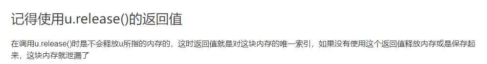**

#### 野指针、迷途指针

**野指针：没有初始化指针**

**空指针：指向地址0的指针**

**迷途指针（悬浮指针）：当所指向的对象被释放或者收回，但是对该指针没有作任何的修改，以至于该指针仍旧指向已经回收的内存地址，此情况下该指针称为迷途指针**

**裸指针：常规指针，裸指针的缺点如下**

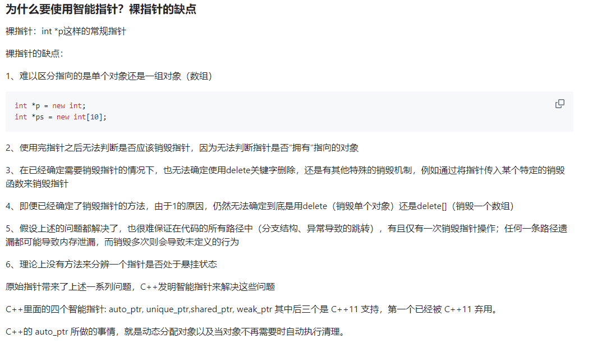

#### delete和析构函数


**类如果有显性的析构函数，如果定义一组对象，首地址会记录对象个数，必须用delete[]**

**类如果没有显性的析构函数，没有记录对象个数，则用delete、delete[]、free都可以**

```c++
class Object
{
public:
	Object()
	{
		cout << "construct object" << this << endl;
	}
};
int main()
{
	Object * op = new Object[10];
	delete op;       //ok
	//delete[] op;   //ok
	//free(op);      //ok
}
```

#### enable_shared_from_this

**如果一个类继承enable_shared_from_this类，则shared_from_this函数会返回一个shared_ptr，指向当前的对象**

```cpp
// std_memory_shared_from_this.cpp
// compile with: /EHsc
#include <memory>
#include <iostream>

using namespace std;

struct base : public std::enable_shared_from_this<base>
{
    int val;
    shared_ptr<base> share_more()
    {
        return shared_from_this();
    }
};

int main()
{
    auto sp1 = make_shared<base>();
    auto sp2 = sp1->share_more();///生成的shared_ptr和sp1一样指向base

    sp1->val = 3;
    cout << "sp2->val == " << sp2->val << endl;
    return 0;
}
```

#### move和forward源码

**一个声明的右值引用其实是一个左值**

**remove_reference去除引用，无论左引用还是右引用**

```cpp
///不论move里面是左值还是右值，都会返回一个右值 
/*
当调用了 remove_reference 后，无论之前是什么情况，都会变成普通的版本，& 或者 && 都会被删除
删除了引用之后，又在后面加了两个 &， 也就是 type&& 这段，相当于不论传入的是什么，都给变成了 &&
之后，通过 static_cast，强行将 __t 转为 右值引用
也就是强制把一个 左值，强转成 右值
*/
template<typename _Tp>
    constexpr typename std::remove_reference<_Tp>::type&&
    move(_Tp&& __t) noexcept
    { return static_cast<typename std::remove_reference<_Tp>::type&&>(__t); } ///remove_reference去除引用，无论左引用还是右引用


 /**
   *  @brief  Forward an lvalue.
   完美转发左值
  根据引用折叠的原理
  _Tp&& 如果_Tp是int&，则返回是左值。如果_Tp是int&&，返回是右值
   *  @return The parameter cast to the specified type.
   *forward 有两个版本，可以接收 & 左值、以及 && 右值的参数
	对于左值，将引用删除，然后强制转换 _Tp&&，因引用折叠，最后会强制转换成左值
	对于右值，会强制转换成右值
	函数包含了 noexcept，表示不会抛出异常；
	constexpr 表示 在编译期间做计算
   *  This function is used to implement "perfect forwarding".
   */
  template<typename _Tp>
    constexpr _Tp&&
    forward(typename std::remove_reference<_Tp>::type& __t) noexcept
    { return static_cast<_Tp&&>(__t); }

  /**
   *  @brief  Forward an rvalue.
   完美转发右值
   *  @return The parameter cast to the specified type.
   *
   *  This function is used to implement "perfect forwarding".
   */
  template<typename _Tp>
    constexpr _Tp&&
    forward(typename std::remove_reference<_Tp>::type&& __t) noexcept
    {
      static_assert(!std::is_lvalue_reference<_Tp>::value, "template argument"
		    " substituting _Tp is an lvalue reference type");
      return static_cast<_Tp&&>(__t);
    }

```


#### STL的算法和容器

**算法和容器都是直接操作迭代器来保证对方的相互独立**


#### 零拷贝

**零拷贝：不用内核和用户态的来回切换，这样会浪费资源**

**sendfile可以用于网络socket**


**tee只能用于管道fd**


#### 委托构造

**构造函数可以在同一个类中一个构造函数调用另一个构造函 数，从而达到简化代码的目的**


#### fgets和scanf总结

**在键盘输入的所有字符，包括回车等，都会保留在缓冲区，fgets和scanf、getchar等都是优先在缓冲区读取数据，所以在使用前最后清空缓冲区**


**最多读取n-1个字符，第n个字符为'\n',第n-1个字符为回车符，缓冲区不会残留回车符**

**与之对应scanf，只读取字符，会将第一个回车符残留在缓冲区，需要用getchar来清理，只匹配字符，遇到空格会中断**


#### sleep函数

**在linux函数中，单位为秒。在win系统中，单位为毫秒**

#### C语言的字符串

**多个\0不会被合并，字符串结尾默认有一个\0**


